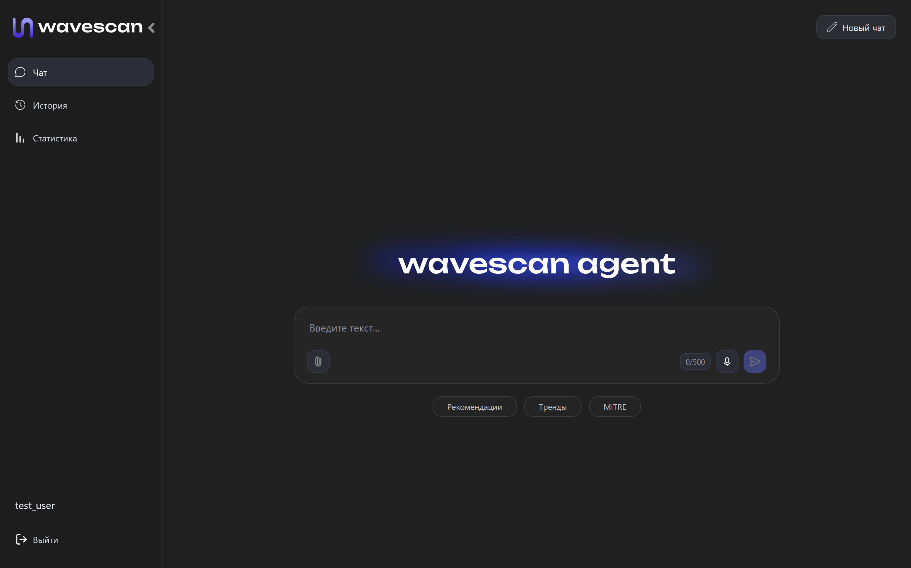

# Wavescan

## Описание

**Wavescan** - интеллектуальная агентная система для анализа логов в области кибербезопасности, предназначенная для выявления угроз, аномалий и инцидентов в автономном режиме.

Система разворачивается локально в инфраструктуре компании, что обеспечивает полный контроль над данными и соответствует требованиям безопасности. Wavescan интегрируется с существующими источниками логов (SIEM, серверы, приложения, сетевые устройства) через Push API или загрузку файлов, не требуя кардинальных изменений в текущей архитектуре.

В основе решения лежит комбинация классических методов анализа (YARA, Sigma правила) и современных технологий искусственного интеллекта. Система не просто обнаруживает подозрительные события, а проводит многоуровневый анализ с использованием LLM, сопоставляет инциденты с базой знаний MITRE ATT&CK и формирует структурированные отчёты с объяснениями, уровнем риска и рекомендациями.

Wavescan выступает как «умный помощник» специалиста по информационной безопасности, снижая нагрузку на команду и ускоряя реакцию на инциденты.

> Wavescan — это не просто SIEM, а AI-powered SOC-аналитик, который не только находит угрозы, но и объясняет их, используя многоэтапный анализ и знания MITRE ATT&CK.

### Сравнение с аналогами

| Критерий                        | Wavescan                          | Splunk              | ELK Stack                | Datadog Security Monitoring |
| ------------------------------- | --------------------------------- | ------------------- | ------------------------ | --------------------------- |
| **Тип системы**                 | AI-powered SOC аналитик           | Классический SIEM   | Log management + SIEM    | Cloud SIEM                  |
| **AI-анализ логов**             | ✅ Глубокий (LLM)                  | ⚠️ Ограниченный     | ❌ Нет (в основном rules) | ⚠️ Частично                 |
| **Контекстное понимание**       | ✅ Да (explainable AI)             | ⚠️ Ограничено       | ❌ Нет                    | ⚠️ Частично                 |
| **Двухэтапный AI-пайплайн**     | ✅ Да (LLM → MITRE → LLM)          | ❌ Нет               | ❌ Нет                    | ❌ Нет                       |
| **MITRE ATT&CK интеграция**     | ✅ Автоматическая + в анализе      | ⚠️ Есть, но вручную | ⚠️ Через плагины         | ⚠️ Есть                     |
| **Автоматические отчеты**       | ✅ С объяснениями и рекомендациями | ⚠️ Частично         | ❌ Нет                    | ⚠️ Частично                 |
| **AI-ассистент (чат)**          | ✅ Да                              | ❌ Нет               | ❌ Нет                    | ❌ Нет                       |
| **Скорость внедрения**          | ✅ Быстрая                         | ❌ Долго             | ⚠️ Средняя               | ✅ Быстрая                   |
| **On-Premise**                  | ✅ Да                              | ✅ Да                | ✅ Да                     | ❌ Нет (облако)              |
| **Сложность настройки**         | ✅ Низкая                          | ❌ Высокая           | ❌ Высокая                | ⚠️ Средняя                  |
| **Требования к квалификации**   | ✅ Низкие (за счет AI)             | ❌ Высокие           | ❌ Высокие                | ⚠️ Средние                  |
| **Стоимость внедрения**         | Низкая                             | Высокая               | Средняя                   | Высокая                |


### Преимущества

- **Быстрый старт**: разворачивается за несколько часов и легко интегрируется в существующую инфраструктуру без сложной настройки.
- **Локальная работа**: все данные остаются внутри компании — это критически важно для организаций с высокими требованиями к безопасности.
- **Глубокий контекстный анализ**: LLM не просто фиксирует событие, а объясняет его: что произошло, почему это опасно и какие последствия возможны.
- **Интеграция с MITRE ATT&CK**: автоматическое сопоставление инцидентов с тактиками и техниками атакующих, что упрощает расследование и реагирование.
- **Снижение нагрузки на специалистов**: автоматизация анализа логов и генерации отчетов экономит часы ручной работы.
- **Масштабируемость**: подходит как для небольших команд, так и для крупных инфраструктур с большим потоком логов.
- **Удобный пользовательский интерфейс**: чат с ИИ, фильтрация инцидентов, история отчетов и push-уведомления делают работу комфортной и быстрой.

### Функционал

- Автономный анализ логов
- Загрузка логов вручную для анализа
- Диалог с ИИ-ассистентом по кибербезопасности
- Формирование подробных отчетов
- Оценка уровня критичности инцидентов
- Ведение статистики
- Хранение истории отчетов
- Система уведомлений

### Пайплайн работы системы

Архитектура анализа построена на **LangGraph** с параллельными ветками обработки:

```
┌─────────────────────────────────────────────────────┐
│              Входные логи                           │
└────────────────────┬───────────────────┬───────────┘
    │                 │                   │
┌───▼────┐      ┌────▼────┐        ┌─────▼────┐
│ Agent 1│      │  YARA   │        │  Sigma   │
│ (LLM)  │      │  Scan   │        │  Scan    │
└───┬────┘      └─────────┘        └──────────┘
    │
┌───▼────┐
│  RAG   │  ← MITRE ATT&CK (ChromaDB)
│(MITRE) │
└───┬────┘
    │
┌───▼────┐
│ Agent 2│  ← Детальный AI-отчёт
│ (LLM)  │
└───┬────┘
    │
    └──────────────────┬───────────────────┐
                       │                   │
                ┌──────▼──────┐            │
                │   Agent 3   │◄───────────┘
                │ (Суммаризация)│
                └──────┬──────┘
                       │
                ┌──────▼──────┐
                │  Финальный   │
                │   Отчёт      │
                └─────────────┘
```

**Этапы обработки:**

1. **Получение логов** — через Kafka, Push API или загрузку файлов.
2. **Параллельный анализ:**
   - **Agent 1 (LLM)** — первичный анализ логов, выявление аномалий и паттернов
   - **YARA Scan** — проверка на malware/exploits по YARA-правилам
   - **Sigma Scan** — проверка SIEM-детекций по Sigma-правилам
3. **Обогащение (RAG)** — сопоставление результатов Agent 1 с MITRE ATT&CK через ChromaDB
4. **Agent 2 (LLM)** — детальный отчёт с оценкой серьёзности и типа угрозы
5. **Agent 3 (LLM)** — финальная суммаризация: объединение AI-анализа, YARA, Sigma и MITRE в единый отчёт
6. **Сохранение** — отчёт и метаданные сохраняются в PostgreSQL
7. **Уведомление** — пользователи получают оповещение о новом инциденте

## Начало работы

### 1. Подготовка модели эмбедингов

Для работы RAG (MITRE ATT&CK) нужна эмбединговая модель `intfloat/multilingual-e5-base` (~1.1 GB).

**Вариант А: Запуск скрипта (рекомендуется)**

```bash
# Из корня репозитория
download_embedding_model.bat        # Windows
```

Скрипт автоматически:
- Проверит HF cache (`~/.cache/huggingface/`) — если модель уже скачана, скопирует оттуда
- Если нет в cache — скачает с HuggingFace (~1-3 минуты)

**Вариант Б: Ручная установка**

```bash
uv run hf download intfloat/multilingual-e5-base \
    --local-dir log_ai_agent/ai_agent_v2/embedding/models/multilingual-e5-base
```

> **Примечание:** Если HuggingFace возвращает `429 Too Many Requests` — подождите 5-15 минут и попробуйте снова. Модель сохраняется локально и при повторных запусках скачивание не потребуется.

**Без модели?** Pipeline запустится без RAG (без MITRE ATT&CK контекста). Основной AI-анализ продолжит работать.

---

### 2. Развёртывание

1. Клонируем репозиторий

```bash
git clone https://gitverse.ru/mitoshi_team/AI-CyberLogAgent
cd AI-CyberLogAgent
```

2. Создаем файл `.env` в папке `log_ai_agent` на основе `.env.example`

```bash
cd log_ai_agent
cp .env.example .env
```

Отредактируйте переменные для базы данных, бэкенда, фронтенда и GigaChat.

3. Запускаем Docker

```bash
docker compose up -d
```

При первом запуске контейнер автоматически скачает модель эмбедингов (~1.1 GB).

4. Переходим на сайт (порт указывается в `.env`)

```bash
http://localhost:{FRONTEND_PORT}/
```

**Готово!**

Для выключения:

```bash
docker compose down
```

> **Примечание:** Модель и ChromaDB сохраняются в Docker volumes (`embedding_models`, `chroma_data`). При `docker compose restart` скачивание не потребуется. При `docker compose down -v` — данные удаляются.

### Визуализация пайплайна

Для просмотра графа выполнения в реальном времени:

```bash
# Генерация ASCII + Mermaid диаграммы
uv run -m log_ai_agent.ai_agent_v2.render_graph
```

Результат:
- ASCII-граф выводится в консоль
- Mermaid-диаграмма сохраняется в `ai_agent_v2/pipeline_graph.mmd`
- Для рендера Mermaid: [mermaid.live](https://mermaid.live) или VS Code расширение

---

### Регистрация пользователя

1. Для подключения к консоли пишем (название контейнера указывается в `.env`, команду нужно писать в корневой папке, по умолчанию - `cyberlog-backend`)

```bash
docker exec -it {BACKEND_CONTAINER_NAME} python app.py interactive
```

2. Регистрируем нового пользователя

```bash
register
```

## Интерфейс





## Структура репозитория

```
AI-CyberLogAgent/
├── download_embedding_model.bat      # Скрипт загрузки модели эмбедингов
├── pyproject.toml                    # Конфигурация Python-зависимостей
├── uv.lock                           # Зафиксированные зависимости
├── .dockerignore                     # Исключения для Docker
├── .gitignore                        # Исключения для Git
├── FUNCTIONAL_SPECIFICATION.md       # Функциональные требования
├── README.md                         # Документация
├── TODO_ideas.md                     # Планы развития
│
└── log_ai_agent/                     # Основной проект
    ├── ai_agent_v2/                  # AI-агент (LangGraph pipeline)
    │   ├── chains/                   # Цепочки обработки (Agent 1/2/3, RAG)
    │   │   ├── agent1.py             # Первичный анализ логов
    │   │   ├── agent2.py             # Детальный AI-отчёт
    │   │   ├── agent3.py             # Финальная суммаризация
    │   │   ├── graph_nodes.py        # LangGraph nodes
    │   │   └── rag_chain.py          # RAG MITRE ATT&CK
    │   ├── embedding/                # Эмбединговая модель
    │   │   ├── manager.py            # Загрузчик локальной модели
    │   │   └── models/               # Скачанная модель (не в Git)
    │   ├── knowledge_base/           # MITRE ATT&CK данные
    │   ├── pipeline/                 # LangGraph pipeline
    │   │   ├── langgraph_pipeline.py # Основной граф
    │   │   └── full_pipeline.py      # Обратная совместимость
    │   ├── chroma_db/                # Векторная БД (не в Git)
    │   ├── render_graph.py           # Визуализация графа
    │   ├── app_integration.py        # Интеграция с FastAPI
    │   └── config.py                 # Конфигурация агента
    │
    ├── pipeline/                     # Приём и обработка логов
    │   ├── kafka_consumer.py         # Потребитель Kafka
    │   └── log_ingest_api.py         # API загрузки логов
    │
    ├── vector/                       # Vector (сбор логов)
    │   ├── vector.toml               # Конфигурация Vector
    │   └── lua/                      # Lua-скрипты
    │
    ├── site/                         # Vue.js фронтенд
    ├── app.py                        # FastAPI приложение
    ├── docker-compose.yml            # Оркестрация контейнеров
    ├── Dockerfile                    # Сборка backend
    ├── docker-entrypoint.sh          # Скрипт запуска контейнера
    └── init-db.sql                   # Инициализация БД
```

## Схема БД

### Таблица Users

- user_id: integer (Уникальный идентификатор пользователя, автоинкремент)
- login: text (Логин пользователя)
- password_hash: text (Хэш пароля)

### Таблица Messages

- message_id: integer (Уникальный идентификатор сообщения, автоинкремент)
- user_id: integer (Внешний ключ на Users, идентификатор пользователя)
- role: text (Роль отправителя сообщения)
- content: text (Содержимое сообщения)
- created_at: timestamp with time zone (Дата и время создания сообщения)

### Таблица ActionTypes

- action_type_id: integer (Уникальный идентификатор типа действия, автоинкремент)
- name: text (Название типа действия)

### Таблица AgentLogs

- agent_log_id: integer (Уникальный идентификатор лога агента, автоинкремент)
- action_type_id: integer (Внешний ключ на ActionTypes, тип действия)
- description: text (Описание действия агента)
- date: timestamp with time zone (Дата и время выполнения действия)

### Таблица UserLogs

- user_log_id: integer (Уникальный идентификатор лога пользователя, автоинкремент)
- user_id: integer (Внешний ключ на Users, пользователь, выполнивший действие)
- action_type_id: integer (Внешний ключ на ActionTypes, тип действия)
- description: text (Описание действия агента)
- date: timestamp with time zone (Дата и время выполнения действия)

### Таблица Logs

- log_id: integer (Уникальный идентификатор лога, автоинкремент)
- file_content: text (Содержимое файла лога)
- date: timestamp with time zone (Дата и время создания лога)

### Таблица Reports

- report_id: integer (Уникальный идентификатор отчета, автоинкремент)
- description: text (Описание инцидента)
- log_id: integer (Внешний ключ на Logs, связанный лог)
- threat_type_id: integer (Внешний ключ на ThreatTypes, тип угрозы)
- created_at: timestamp with time zone (Дата и время создания отчета)
- severity_level_id (Внешний ключ на SeverityLevels, уровень серьезности)

### Таблица ThreatTypes

- threat_type_id: integer (Уникальный идентификатор типа угрозы, автоинкремент)
- name: text (Название типа угрозы)

### Таблица SeverityLevels

- severity_level_id (Уникальный идентификатор уровня серьезности, автоинкремент)
- name: text (Название уровня серьезности)
