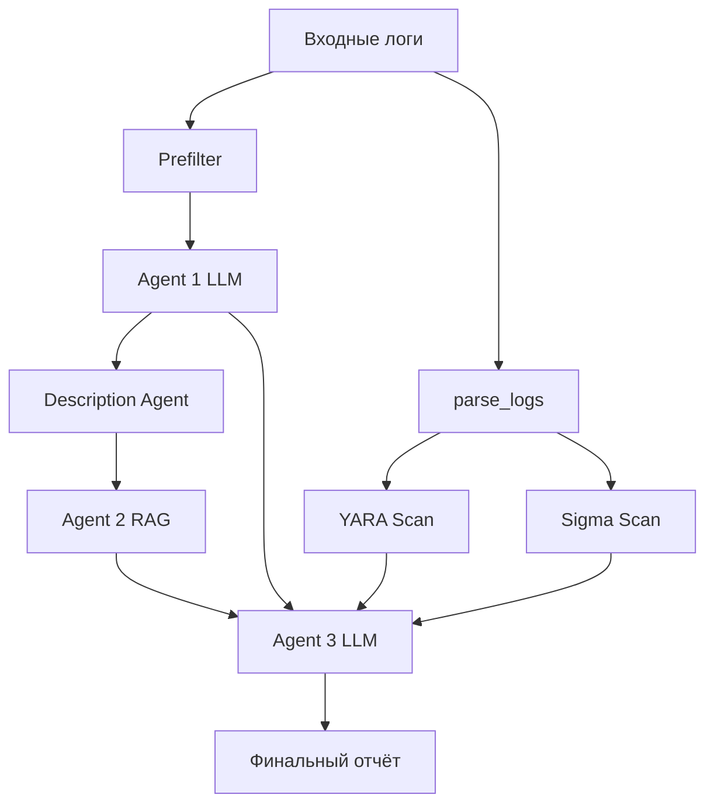
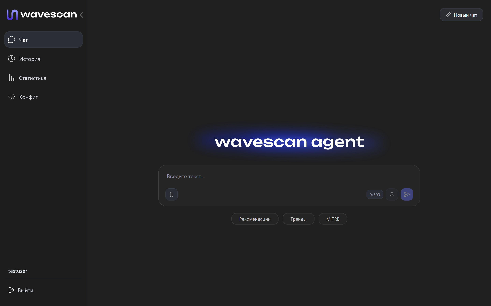
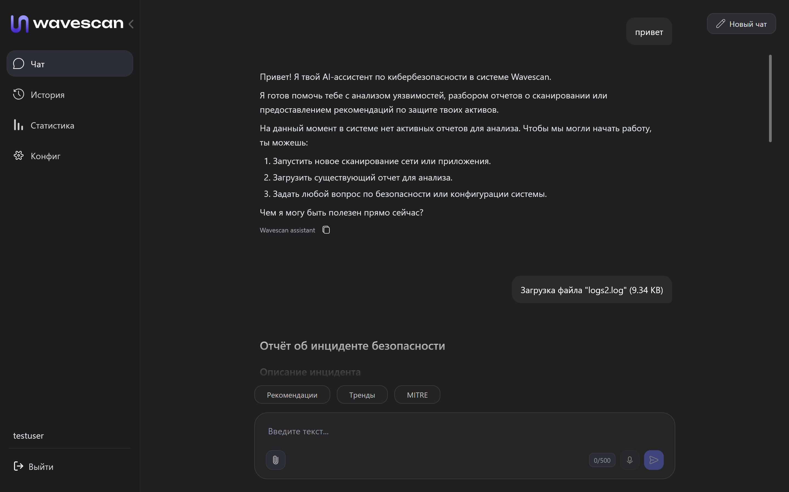
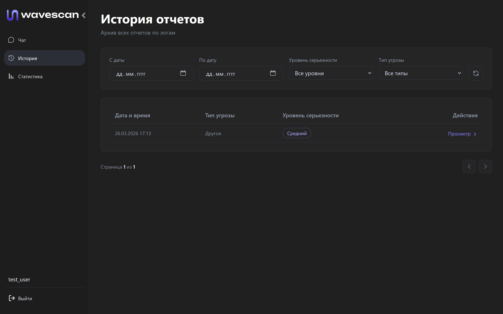
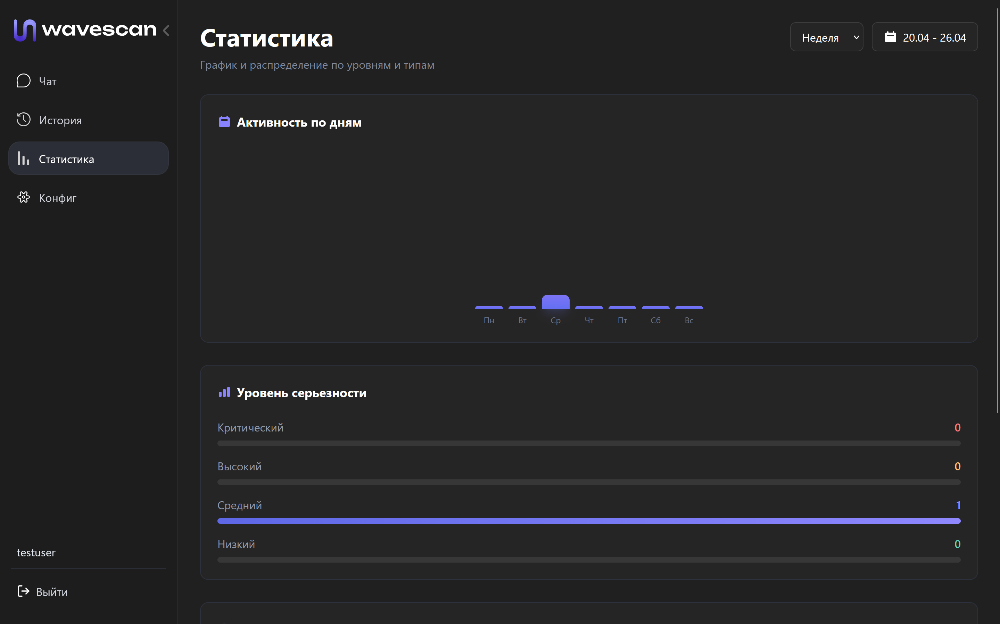
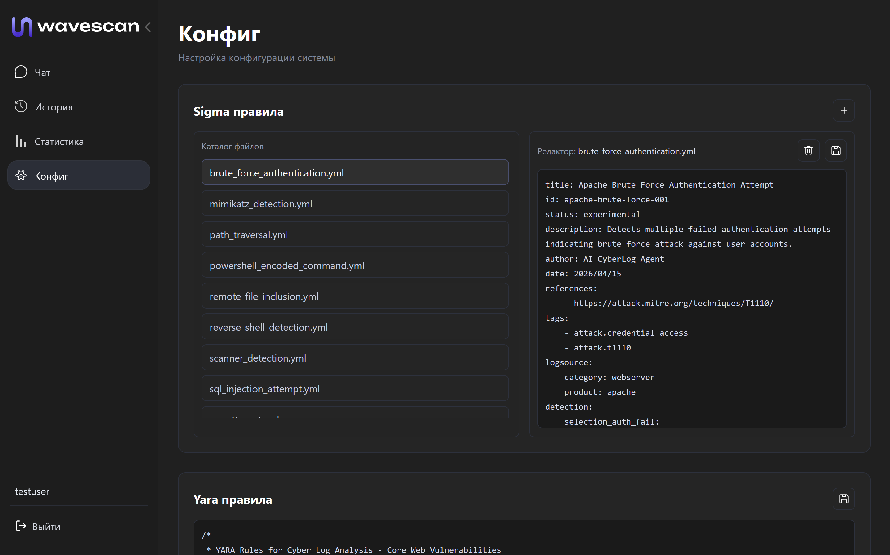

# Wavescan

## Описание

**Wavescan** - интеллектуальная агентная система для анализа логов в области кибербезопасности, предназначенная для выявления угроз, аномалий и инцидентов в автономном режиме.

Система разворачивается локально в инфраструктуре компании, что обеспечивает полный контроль над данными и соответствует требованиям безопасности. Wavescan интегрируется с существующими источниками логов (SIEM, серверы, приложения, сетевые устройства) через Push API или общий том для логов, не требуя кардинальных изменений в текущей архитектуре.

В основе решения лежит комбинация классических методов анализа (YARA, Sigma-правила) и современных технологий искусственного интеллекта. Система не просто обнаруживает подозрительные события, а проводит многоуровневый анализ с использованием LLM, сопоставляет инциденты с базой знаний MITRE ATT&CK, а также поддерживает автоматическую генерацию YARA-правил агентом на основе выявленных аномалий и новых паттернов угроз. Это позволяет оперативно адаптировать систему обнаружения под изменяющийся ландшафт атак. По результатам анализа Wavescan формирует структурированные отчёты с объяснениями, уровнем риска и рекомендациями.

Wavescan выступает как "умный помощник" специалиста по информационной безопасности, снижая нагрузку на команду и ускоряя реакцию на инциденты.

> Wavescan - это не просто SIEM, а AI-powered SOC-аналитик, который не только находит угрозы, но и объясняет их, используя многоэтапный анализ и знания MITRE ATT&CK.

### Сравнение с аналогами

| Критерий                        | Wavescan                          | Splunk              | ELK Stack                | Datadog Security Monitoring |
| ------------------------------- | --------------------------------- | ------------------- | ------------------------ | --------------------------- |
| **Тип системы**                 | AI-powered SOC аналитик           | Классический SIEM   | Log management + SIEM    | Cloud SIEM                  |
| **AI-анализ логов**             | ✅ Глубокий (LLM)                  | ⚠️ Ограниченный     | ❌ Нет (в основном rules) | ⚠️ Частично                 |
| **Контекстное понимание**       | ✅ Да (explainable AI)             | ⚠️ Ограничено       | ❌ Нет                    | ⚠️ Частично                 |
| **Двухэтапный AI-пайплайн**     | ✅ Да (LLM → MITRE → LLM)          | ❌ Нет               | ❌ Нет                    | ❌ Нет                       |
| **MITRE ATT&CK интеграция**     | ✅ Автоматическая + в анализе      | ⚠️ Есть, но вручную | ⚠️ Через плагины         | ⚠️ Есть                     |
| **Автоматические отчеты**       | ✅ С объяснениями и рекомендациями | ⚠️ Частично         | ❌ Нет                    | ⚠️ Частично                 |
| **Автогенерация yara правил**   | ✅ Да                              | ❌ Нет              | ❌ Нет                    | ❌ Нет                 |
| **AI-ассистент (чат)**          | ✅ Да                              | ❌ Нет               | ❌ Нет                    | ❌ Нет                       |
| **Скорость внедрения**          | ✅ Быстрая                         | ❌ Долго             | ⚠️ Средняя               | ✅ Быстрая                   |
| **On-Premise**                  | ✅ Да                              | ✅ Да                | ✅ Да                     | ❌ Нет (облако)              |
| **Сложность настройки**         | ✅ Низкая                          | ❌ Высокая           | ❌ Высокая                | ⚠️ Средняя                  |
| **Требования к квалификации**   | ✅ Низкие (за счет AI)             | ❌ Высокие           | ❌ Высокие                | ⚠️ Средние                  |
| **Стоимость внедрения**         | Низкая                             | Высокая               | Средняя                   | Высокая                |

### Преимущества

- **Быстрый старт**: разворачивается за несколько часов и легко интегрируется в существующую инфраструктуру без сложной настройки.
- **Локальная работа**: все данные остаются внутри компании — это критически важно для организаций с высокими требованиями к безопасности.
- **Глубокий контекстный анализ**: LLM не просто фиксирует событие, а объясняет его: что произошло, почему это опасно и какие последствия возможны.
- **Интеграция с MITRE ATT&CK**: автоматическое сопоставление инцидентов с тактиками и техниками атакующих, что упрощает расследование и реагирование.
- **Снижение нагрузки на специалистов**: автоматизация анализа логов и генерации отчетов экономит часы ручной работы.
- **Масштабируемость**: подходит как для небольших команд, так и для крупных инфраструктур с большим потоком логов.
- **Удобный пользовательский интерфейс**: чат с ИИ, фильтрация инцидентов, история отчетов и push-уведомления делают работу комфортной и быстрой.
- **Удобная конфигурация**: возможность добавить/редактировать/удалить yara и sigma правила через веб-интерфейс.

### Функционал

- Автономный анализ логов из внешего источника
- Загрузка логов вручную для анализа
- Диалог с ИИ-ассистентом по кибербезопасности
- Формирование подробных отчетов
- Автогенерация YARA-правил по найденным MITRE-техникам (LLM + валидация)
- Оценка уровня критичности инцидентов
- Ведение статистики
- Хранение истории отчетов
- Система уведомлений
- Настройка yara и sigma правил (создание, редактирование и удаление)

### Пайплайн работы системы

Архитектура анализа построена на **LangGraph** с параллельными ветками обработки:



**Этапы обработки:**

1. **Prefilter** — фильтрация логов для Agent 1 (удаление "мусора" — heartbeat, health check и т.д.)
2. **Параллельный анализ:**
   - **Agent 1 (LLM)** — первичный анализ отфильтрованных логов, выявление аномалий и паттернов
   - **parse_logs** — парсинг всех логов (без фильтрации)
3. **Сканирование (после parse_logs, все логи):**
   - **YARA Scan** — проверка на malware/exploits по YARA-правилам
   - **Sigma Scan** — проверка SIEM-детекций по Sigma-правилам
4. **Description Agent** — генерация структурированных описаний для найденных групп событий (категория, ключевые слова, severity, временной диапазон)
5. **Agent 2 (RAG)** — поиск MITRE ATT&CK техник для каждой группы по описанию от Description Agent
6. **Agent 3 (LLM)** — финальная суммаризация: объединение AI-анализа, YARA, Sigma, MITRE и прямого выхода Agent 1 в единый отчёт
7. **YARA Generator** — для каждой MITRE-техники без покрытия генерирует YARA-правило (LLM → компиляция → проверка на логах → ревью LLM). Предложения сохраняются в БД для подтверждения админом
8. **Сохранение** — отчёт и метаданные сохраняются в PostgreSQL
9. **Уведомление** — пользователи получают оповещение о новом инциденте

## Требования

- Docker
- Ollama с LLM (любая модель, например llama3.2:latest)
- 8+ GB RAM


## Начало работы

### Для пользователя

1. Находим последний релиз по [ссылке](https://github.com/Mitoshi-Team/AI-CyberLogAgent/releases) и скачиваем архив с файлами из Assets

2. Распаковываем архив и переходим в папку

3. Переименовываем `.env.example` в `.env`

**Обязательно отредактируйте следующие переменные**:
- `OLLAMA_URL` и `OLLAMA_MODEL` - ваша локальная модель Ollama
- `POSTGRES_PASSWORD` - пароль для базы данных
- `PASSWORD_SALT` - соль для хэширования паролей

*Опционально можно отредактировать:*
- `VITE_SBER_SPEECH_API_KEY` - ключ от SberSpeech (для активации голосового ввода)
- `CLI_TZ_OFFSET_HOURS` - ваш часовой пояс

4. Запускаем Docker

```bash
docker compose up -d
```

*Ждем, пока все образы сами подтянутся с DockerHub*

5. Переходим на сайт (порт указывается в `.env`, по умолчанию - `3000`)

```bash
http://localhost:{FRONTEND_PORT}/
```

**Готово!**

Для выключения:

```bash
docker compose down
```

#### Регистрация пользователя

1. Для подключения к консоли пишем (название контейнера указывается в `.env`, команду нужно писать в корневой папке, по умолчанию - `cyberlog-backend`)

```bash
docker exec -it {BACKEND_CONTAINER_NAME} python app.py interactive
```

2. Регистрируем нового пользователя

```bash
register
```

3. Управление правами администратора и просмотр пользователей

```bash
users
set_admin <login> on
set_admin <login> off
```

Раздел **«Конфиг»** в веб-интерфейсе доступен только пользователям с `is_admin = true`.

#### Подключение внешнего источника логов

Wavescan принимает внешние логи через общий Docker-том (файлы `.log`/`.txt`) или через Push API. Для потоковых источников проще всего писать в общий том — Vector автоматически подхватит файлы из него.

1. В `.env` проверьте параметры общего тома и пути:

```bash
PIPELINE_EXTERNAL_LOGS_VOLUME_NAME=cyberlog_external_logs
PIPELINE_EXTERNAL_LOGS_DIR=/app/shared/external
PIPELINE_EXTERNAL_APPEND_FILE=/app/shared/external/external_stream.log
```

2. В своей программе:
- смонтируйте тот же Docker-том (например, в `/var/log/golden` или `/data/external`)
- пишите логи в `.log` или `.txt` (append-only), чтобы Vector прочитал их из общего тома

**Альтернатива:** отправляйте логи через Push API: `POST /api/pipeline/logs/upload` или `POST /api/pipeline/logs/text`. Подробности: `log_ai_agent/pipeline/README_INGEST_API.md`.

#### Визуализация пайплайна

Для просмотра графа выполнения в реальном времени:

```bash
# Генерация ASCII + Mermaid диаграммы
uv run -m log_ai_agent.ai_agent_v2.visual_graph.render_graph
```

Результат:
- ASCII-граф выводится в консоль
- Mermaid-диаграмма сохраняется в `log_ai_agent/ai_agent_v2/visual_graph/pipeline_graph.mmd`
- Для рендера Mermaid: [mermaid.live](https://mermaid.live) или VS Code расширение

-----

### Для разработчика

1. Клонируем репозиторий

```bash
git clone https://github.com/Mitoshi-Team/AI-CyberLogAgent
```

2. Переходим в папку

```bash
cd log_ai_agent
```

3. Создаем .env на основе .env.example

```bash
cp .env.example .env
```

**Обязательно отредактируйте следующие переменные**:
- `OLLAMA_URL` и `OLLAMA_MODEL` - ваша локальная модель Ollama
- `POSTGRES_PASSWORD` - пароль для базы данных
- `PASSWORD_SALT` - соль для хэширования паролей

*Опционально можно отредактировать:*
- `VITE_SBER_SPEECH_API_KEY` - ключ от SberSpeech (для активации голосового ввода)
- `CLI_TZ_OFFSET_HOURS` - ваш часовой пояс

4. Запускаем сборку Docker-образов

```bash
docker compose up -d
```

*Ждем, пока скачаются все нужные зависимости и поднимутся все контейнеры*

5. Переходим на сайт (порт указывается в `.env`, по умолчанию - `3000`)

```bash
http://localhost:{FRONTEND_PORT}/
```

**Готово!**

Для выключения:

```bash
docker compose down
```

## Консоль администратора

В системе предусмотрена консоль администратора, которая запускается из корневой папки проекта по команде

```bash
docker exec -it {BACKEND_CONTAINER_NAME} python app.py interactive
```

### Команды

- help - вывод списка всех команд
- register - регистрация нового пользователя
- users - вывод списка всех пользователей
- set_admin - назначить/снять админа
- agent_logs - просмотр логов агента
- user_logs - просмотр логов пользователей
- pipeline_lines - показывает текущее количество строк логов в очереди на анализ (команда для отладки)
- processed_lines - вывод последних строк из проанализированных логов (команда для отладки)
- clear_pipeline_logs - полная очистка всех логов из пайплайна
- agent_status - показать текущий статус агента
- exit - выйти из консоли

## Интерфейс

Скриншоты интерфейса (находятся в `log_ai_agent/src/`):












## Структура репозитория

```
AI-CyberLogAgent/
├── download_embedding_model.bat      # Скрипт загрузки модели эмбедингов
├── pyproject.toml                    # Конфигурация Python-зависимостей
├── uv.lock                           # Зафиксированные зависимости
├── .dockerignore                     # Исключения для Docker
├── .gitignore                        # Исключения для Git
├── README.md                         # Документация
│
├── mitre_log_simulator/              # Симулятор логов MITRE
│   ├── docker-compose.yml
│   ├── Dockerfile
│   ├── generator.py
│   ├── README.md
│   └── run.ps1
│
├── quick_start/                      # Быстрый запуск (compose + env)
│   ├── .env.example
│   └── docker-compose.yml
│
└── log_ai_agent/                     # Основной проект
    ├── .env                          # Конфигурация (не в Git)
    ├── .env.example                  # Пример конфигурации
    ├── app.py                        # FastAPI приложение
    ├── docker-compose.yml            # Оркестрация контейнеров
    ├── Dockerfile                    # Сборка backend
    ├── docker-entrypoint.sh          # Скрипт запуска
    ├── init-db.sql                   # Инициализация БД
    │
    ├── config/                       # Конфигурация CLI
    │   ├── cfg.py                    # Настройки
    │   └── commands.py               # Команды CLI
    │
    ├── src/                          # Скриншоты интерфейса
    │   ├── page1.png                 # Страница авторизации
    │   ├── page2_1.png               # Чат с ассистентом
    │   ├── page2_2.png               # Чат с ассистентом
    │   ├── page3.png                 # История отчетов
    │   ├── page4.png                 # Статистика инцидентов
    │   └── page5.png                 # Конфигурация правил
    │
    ├── ai_agent_v2/                  # AI-агент (LangGraph pipeline)
    │   ├── chains/                   # Цепочки обработки
    │   │   ├── agent1.py             # Первичный анализ логов
    │   │   ├── agent2.py             # RAG-обогащение событий
    │   │   ├── agent3.py             # Финальная суммаризация
    │   │   ├── description_agent.py  # Генерация описаний техник
    │   │   ├── graph_nodes.py        # LangGraph узлы
    │   │   ├── llm.py                # LLM провайдер
    │   │   ├── prefilter.py          # Предобработка логов
    │   │   ├── rag_chain.py          # RAG MITRE ATT&CK
    │   │   ├── yara_generator.py     # Генерация YARA-правил
    │   │   └── providers/            # LLM провайдеры
    │   │       ├── base.py           # Базовый класс
    │   │       ├── ollama.py         # Ollama провайдер
    │   │       └── openai.py         # OpenAI-совместимый провайдер
    │   ├── engines/                  # Сигнатурные движки
    │   │   ├── yara_engine.py        # YARA сканер (yara-python)
    │   │   └── sigma_engine.py       # Sigma сканер (pysigma)
    │   ├── knowledge_base/           # MITRE ATT&CK данные
    │   │   ├── manager.py            # ChromaDB менеджер
    │   │   ├── mitre_loader.py       # Загрузчик MITRE
    │   │   ├── mitre_processed.json  # Обработанные техники (88 шт.)
    │   │   └── enterprise-attack.json# STIX-дамп (резервный)
    │   ├── models/                   # Типы данных
    │   │   └── schemas.py            # Pydantic схемы
    │   ├── parsers/                  # Парсеры логов
    │   │   └── apache_parser.py      # Apache парсер
    │   ├── pipeline/                 # LangGraph pipeline
    │   │   ├── langgraph_pipeline.py # Основной граф (StateGraph)
    │   │   └── README_PIPELINE.md    # Документация пайплайна
    │   ├── prompts/                  # Промты для LLM
    │   │   ├── system.py             # Системный промпт
    │   │   ├── log_analysis.py       # Промпт анализа логов
    │   │   └── yara_generation.py    # Промпт генерации YARA
    │   ├── rules/                    # Правила обнаружения
    │   │   ├── yara/                 # YARA правила (8 шт.)
    │   │   └── sigma/                # Sigma правила (9 шт.)
    │   ├── embedding/                # Эмбединговая модель
    │   │   ├── manager.py            # Загрузчик модели
    │   │   └── models/               # Модель (не в Git)
    │   │       └── multilingual-e5-base/
    │   ├── visual_graph/             # Визуализация графа
    │   │   └── render_graph.py       # Рендер (ASCII + Mermaid)
    │   ├── metrics/                  # Метрики качества детекции
    │   │   ├── evaluate.py           # Сравнение ground truth с детекциями
    │   │   ├── metrics_logger.py     # Логирование метрик после анализа
    │   │   ├── README_METRICS.md     # Документация метрик
    │   │   ├── pipeline_metrics.log  # Журнал детекций (создаётся)
    │   │   └── TESTS_DATA/           # Тестовые данные и отчёты
    │   │       ├── SUMMARY_REPORT.md
    │   │       ├── test1/
    │   │       └── test2/
    │   ├── examples/                 # Примеры использования
    │   │   └── basic.py
    │   ├── chroma_db/                # Векторная БД (создаётся)
    │   ├── pipeline_tests/           # Тесты пайплайна
    │   │   ├── conftest.py
    │   │   ├── rag_ground_truth.json
    │   │   ├── run_rag_eval.py
    │   │   ├── test_agent1.py
    │   │   ├── test_agent3.py
    │   │   ├── test_description_agent.py
    │   │   ├── test_full_pipeline.py
    │   │   ├── test_graph_nodes.py
    │   │   ├── test_llm.py
    │   │   ├── test_new_features.py
    │   │   ├── test_pipeline_basic.py
    │   │   ├── test_prefilter.py
    │   │   ├── test_quick.py
    │   │   ├── test_rag.py
    │   │   ├── test_rag_eval.py
    │   │   ├── test_rag_evaluation.py
    │   │   ├── test_rag_flow.py
    │   │   ├── test_yara.py
    │   │   ├── test_yara_generator.py
    │   │   └── test_yara_sigma.py
    │   ├── app_integration.py        # Интеграция с FastAPI
    │   ├── callbacks.py              # Колбэки
    │   ├── chat_integration.py       # Чат с ИИ
    │   ├── config.py                 # Конфигурация агента
    │   ├── init_mitre.py             # Инициализация MITRE
    │   ├── models_types.py           # Типы моделей
    │   ├── run.py                    # Точка входа
    │   └── README.md                 # Документация модуля
    │
    ├── pipeline/                     # Приём и обработка логов
    │   ├── __init__.py
    │   ├── kafka_consumer.py         # Потребитель Kafka
    │   ├── log_ingest_api.py         # API загрузки логов
    │   ├── README_INGEST_API.md      # Документация API
    │   └── examples/
    │       └── send_logs_to_ingest_api.py
    │
    ├── postgres/                     # Контейнер PostgreSQL
    │   └── Dockerfile
    │
    ├── vector/                       # Vector (сбор логов)
    │   ├── vector.toml               # Конфигурация Vector
    │   ├── Dockerfile
    │   └── lua/
    │       └── chunk_logs.lua
    │
    └── site/                         # Vue.js фронтенд
        ├── public/                   # Статические ресурсы (SVG, звуки)
        ├── src/                      # Исходники (Vue, Pinia, Router)
        ├── dist/                     # Сборка (генерируется)
        ├── Dockerfile                # Сборка фронтенда
        ├── nginx.conf                # Конфигурация Nginx
        └── package.json              # Зависимости фронтенда
```

## Схема БД

### Таблица Users

- user_id: integer (Уникальный идентификатор пользователя, автоинкремент)
- login: text (Логин пользователя)
- password_hash: text (Хэш пароля)
- is_admin: bool (Наличие прав админа)

### Таблица Messages

- message_id: integer (Уникальный идентификатор сообщения, автоинкремент)
- user_id: integer (Внешний ключ на Users, идентификатор пользователя)
- role: text (Роль отправителя сообщения)
- content: text (Содержимое сообщения)
- created_at: timestamp with time zone (Дата и время создания сообщения)

### Таблица ActionTypes

- action_type_id: integer (Уникальный идентификатор типа действия, автоинкремент)
- name: text (Название типа действия)

### Таблица AgentLogs

- agent_log_id: integer (Уникальный идентификатор лога агента, автоинкремент)
- action_type_id: integer (Внешний ключ на ActionTypes, тип действия)
- description: text (Описание действия агента)
- date: timestamp with time zone (Дата и время выполнения действия)

### Таблица UserLogs

- user_log_id: integer (Уникальный идентификатор лога пользователя, автоинкремент)
- user_id: integer (Внешний ключ на Users, пользователь, выполнивший действие)
- action_type_id: integer (Внешний ключ на ActionTypes, тип действия)
- description: text (Описание действия агента)
- date: timestamp with time zone (Дата и время выполнения действия)

### Таблица Logs

- log_id: integer (Уникальный идентификатор лога, автоинкремент)
- file_content: text (Содержимое файла лога)
- date: timestamp with time zone (Дата и время создания лога)

### Таблица Reports

- report_id: integer (Уникальный идентификатор отчета, автоинкремент)
- description: text (Описание инцидента)
- log_id: integer (Внешний ключ на Logs, связанный лог)
- threat_type_id: integer (Внешний ключ на ThreatTypes, тип угрозы)
- created_at: timestamp with time zone (Дата и время создания отчета)
- severity_level_id (Внешний ключ на SeverityLevels, уровень серьезности)

### Таблица ThreatTypes

- threat_type_id: integer (Уникальный идентификатор типа угрозы, автоинкремент)
- name: text (Название типа угрозы)

### Таблица SeverityLevels

- severity_level_id: integer (Уникальный идентификатор уровня серьезности, автоинкремент)
- name: text (Название уровня серьезности)

### Таблица YaraRules

- yara_rule_id: integer (Уникальный идентификатор yara правила, автоинкремент)
- name: text (Название правила)
- content: text (Содержимое правила)
- created_at: timestamp with time zone (Дата и время создания правила)
- updated_at: timestamp with time zone (Дата и время последнего обновления правила)

### Таблица SigmaRules

- sigma_rule_id: integer (Уникальный идентификатор sigma правила, автоинкремент)
- name: text (Название правила)
- content: text (Содержимое правила)
- created_at: timestamp with time zone (Дата и время создания правила)
- updated_at: timestamp with time zone (Дата и время последнего обновления правила)

### Таблица PendingYaraRules

- pending_rule_id: integer (Уникальный идентификатор предложенного yara правила, автоинкремент)
- rule_name: text (Название предложенного правила)
- rule_content: text (Содержимое предложенного правила)
- technique_id: text (ID техники)
- technique_name: text (Название техники)
- report_id: integer (Внешний ключ на Reports, связанный отчет)
- status: text (Статус предложенного правила)
- created_at: timestamp with time zone (Дата и время создания предложенного правила)

## Метрики качества

Подробная документация: `ai_agent_v2/metrics/README_METRICS.md`    
Текущая сводка: `ai_agent_v2/metrics/TESTS_DATA/SUMMARY_REPORT.md`

## О разработчиках

Проект разработан командой **Mitoshi Team** в рамках проектного практикума в УрФУ.

### Состав команды разработчиков

- **Никита Лецколюк** - Team Lead, Software architect
- **Матвей Вахрушев** - AI engineer, Back-end developer
- **Михаил Видякин** - Back-end developer
- **Савелий Вялков** - Front-end developer
- **Сотник Тимур** - Systems analyst
- **Николай Кочкин** - Test engineer

### Контакты

Почта - nikitaletskolyuk@gmail.com    
Telegram - @sser1to

## Copyright

Copyright © 2025 Mitoshi Team. All rights reserved.

This repository and its contents are the intellectual property of Mitoshi Team. Unauthorized copying, modification, distribution, or use of this software, in whole or in part, is prohibited without prior written permission from the authors.
